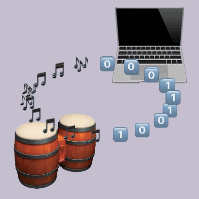

# BongoBoard

Drums have been used as a [communication tool](https://en.wikipedia.org/wiki/Drums_in_communication) (distance/ceremony/etc) for eons. Why not use them to communicate with your own electronic devices?!

BongoBoard is the world's ~~[first](https://www.reddit.com/r/badUIbattles/comments/gha25t/ascii_input_keyboard_the_binary_bongos/)~~ ~~[second](https://medium.com/@jam1garner/how-i-turned-my-dk-bongos-into-a-keyboard-897299f71835)~~ umpteenth bongo-based human computer interface! Much like a stenographer's chorded [stenotype keyboard](https://en.wikipedia.org/wiki/Stenotype) enables realtime transcription, this unchorded [bongo board](https://en.wikipedia.org/wiki/GameCube_accessories#DK_Bongos) facilitates computer input at up to X BPM (bongos per minute)---not to mention its yell modifier! 

Future input modes may include:
- `morse code` mode: drum your message madly!
- `binary` mode: drum your bytes madly!
- `git` mode: you drummed your changes, now drum your commit!
- `mouse` mode: drum to control the mouse!

## Usage 

Once you've set up your controller, and connected to it over bluetooth, you can use it in the following modes. To switch modes, do TODO.

### Morse code mode

TODO - implement!

## Hardware setup

Starting with a DK Bongo controller (or other set of 6 button inputs + microphone), connect them to an [Adafruit nRF52840 Feather](https://learn.adafruit.com/introducing-the-adafruit-nrf52840-feather) according to the following schematic: 

TODO-schematic 

## Controller setup

1. Connect the Feather to your computer via USB cable. (Note: I ran these steps from a Mac running Sonoma 14.6.1; you may need to tweak things slightly for a different OS.)

2. Download `feather_nrf52840_express_bootloader-0.8.0_s140_6.1.1.zip` from https://github.com/adafruit/Adafruit_nRF52_Bootloader/releases/tag/0.8.0

3. Update the board's bootloader, so that we'll be able to run CircuitPython on it. Do this by following one of the paths in the [Adafruit instructions](https://learn.adafruit.com/introducing-the-adafruit-nrf52840-feather/update-bootloader); I did this via the [CLI options](https://learn.adafruit.com/introducing-the-adafruit-nrf52840-feather/update-bootloader-use-command-line#download-adafruit-nrfutil-3108972) route, namely, 
    1. Downloaded the `adafruit-nrfutil` executable
    2. In terminal, ran `ls /dev/cu.*` in the terminal to find my Feather's device name (mine was `/dev/cu.usbmodem1101`)
    3. In terminal, ran 
        ```
        ./adafruit-nrfutil --verbose dfu serial --package ~/Downloads/feather_nrf52840_express_bootloader-0.8.0_s140_6.1.1.zip -p /dev/cu.usbmodem1101 -b 115200 --singlebank --touch 1200
        ```
    The Feather will then be visible in Finder; mine showed up as `FTHR840BOOT`

4. In the terminal, cd onto the Feather and clone this repository onto it. 

### Dev notes

[Logo](https://editor.p5js.org/hannahilea/sketches/77GaUZb62) created in p5.js; adapted from preexisting [earth/moon/orbit sketch](https://happycoding.io/tutorials/p5js/arrays/earth-moon-emoji-orbit).
